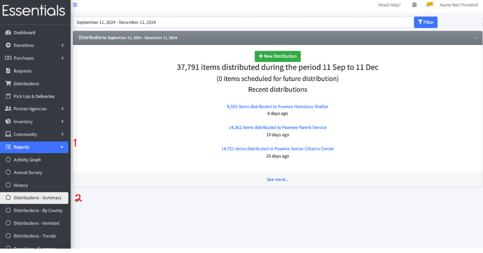
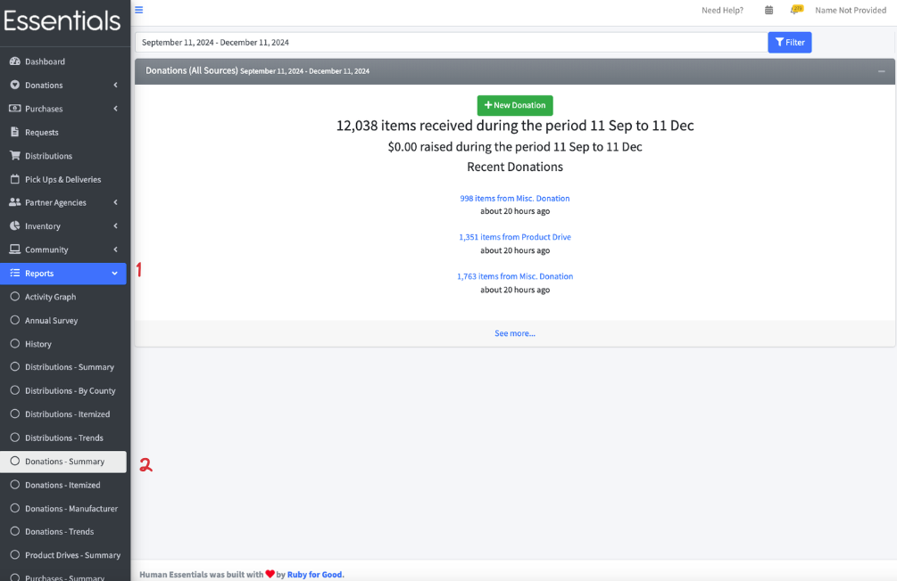
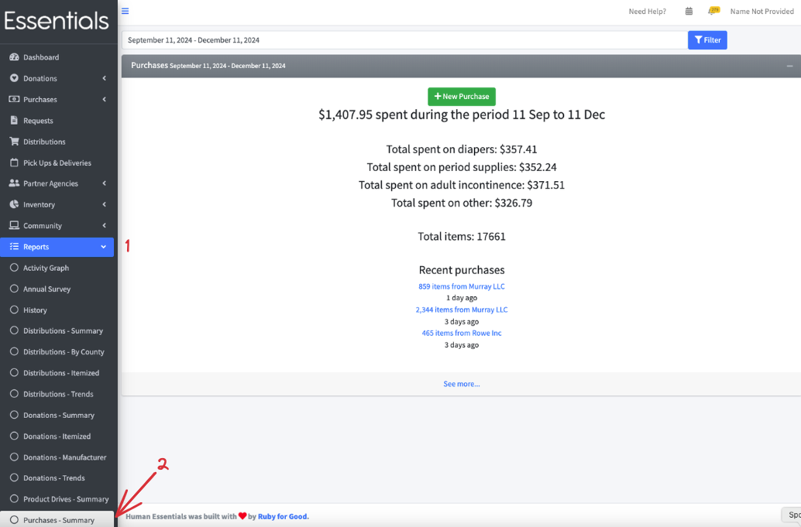

# Summary Reports

There are 3 Summary reports - one each for Distributions, Donations, and Purchases

These each allow you to quickly get the number of Items dealt with in a timeframe, plus links to recent activity

## Distribution Summary
This gives the number of Items distributed -- initially for the last 60 days (and 30 days forward), but you can filter by whatever date range you wish.  This filtering works against the "issued_at" date on the Distribution, rather than the date it was entered. 

The report also gives the number of Items that are in Distributions that have an "issued at" in the future.

The "Recent Distributions" section shows recent Distributions that match the date filter, based on the date entered for the distribution (rather than when it was entered).

## Donation Summary
This is quite similar to the Distribution summary, above.

This gives the number of Items donated -- initially for the last 60 days, but you can filter by whatever date range you wish.  This filtering works against the "issued on" date on the Donation, rather than the date it was entered.
It also gives the total of monetary donations recorded in the system for that period
The "Recent Donations" section shows recent Donations that match the date filter.  

## Purchase Summary
This presents the amounts spent during the period, along with recent Purchases that match the date filter. 

[Prior:  Exports](exports.md)[Next: Itemized reports](reports_itemized_reports.md)