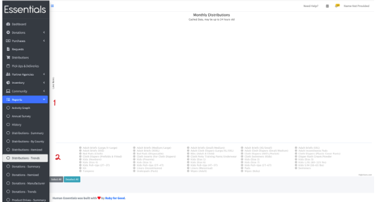
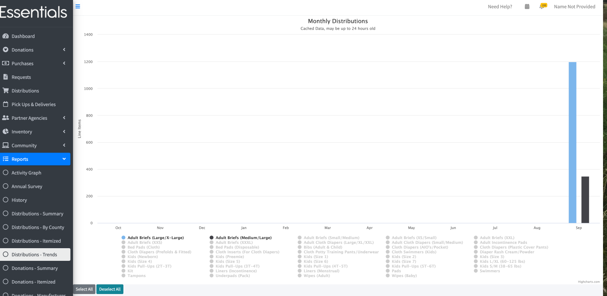
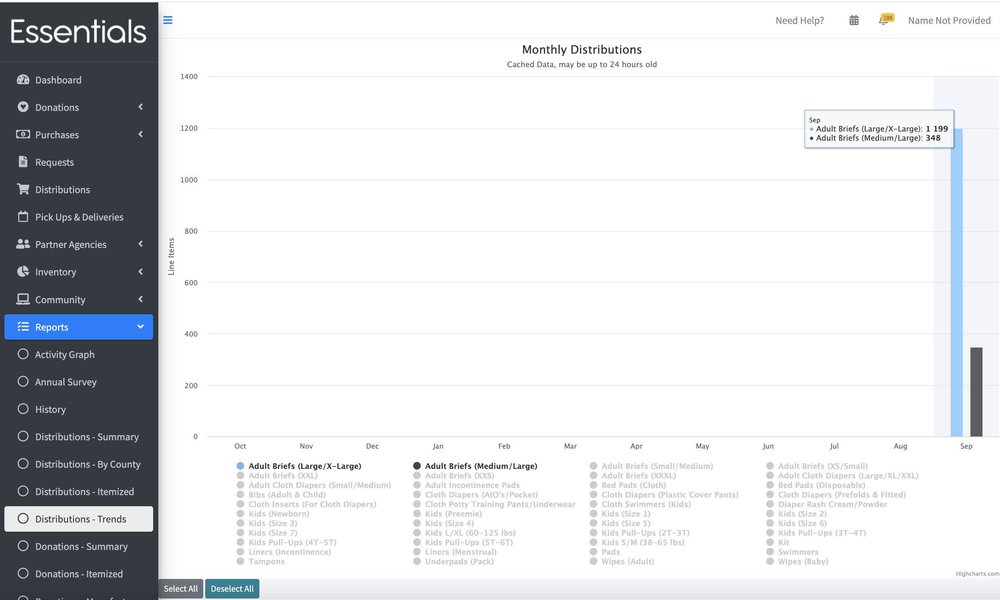

DRAFT USER GUIDE
# Trends Reports
The trends reports (one each for Distributions, Donations, and Purchases) give you a picture of the activity on any item over the last 12 months. 

The examples below will use the Distributions - Trends report, but everything is basically the same for Donations- Trends and Purchases - Trends.

Please note that the levels for these reports may be up to 24 hours old -- we generate the overnight because it would be a very slow report otherwise.

## Navigation
To bring up the Distributions - Trends Report,  click on "Reports", then "Distributions - Trends" 

This will bring up a blank "Monthly" Distributions report, like so: 

To see the activity on a particular item, click on that item.   You can click on as many as you want -- if, for instance, you want compare the distributions of multiple sizes, you can do that -- but in general, fewer will be better.

(Our test data only has very recent data in it, so you'll see more bars, unless of course, you are a brand new bank!)

You can also hover over any month to see the numerical levels for the chosen items for that month.  

To clear the items - either click on them again,  or click "Deselect All"

You can click "Select All" to see *all* the items,  but that will produce a very busy visual.

[Prior - Itemized reports](reports_itemized_reports.md)    [Next - Annual Survey](reports_annual_survey.md)