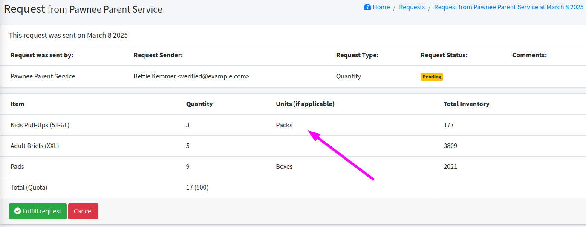

# Custom Units (opt-in feature)

Custom Units addresses a long-standing problem that diaper banks, in particular, experience:

- On the one hand, when you are tracking raw inventory, writing grant proposals, or working with the NDBN, you need to know how many individual diapers you distribute.
- On the other hand, partners often want to work in terms of "packs" of diapers.

Unfortunately,  there isn't a standard number of diapers in a "pack", even in the same size (sometimes not even with the same manufacturer!), so we can't just convert one to the other.

Custom Units is our solution so that the partners can order in terms of "packs", "boxes", "flats", etc, but you as the Bank still work in terms of individual diapers.

You can specify different units (e.g. packs, boxes, flats) that the partners can use to order items, or the partner can still request them by the number of individual items ("units").

You'll see the number of "packs" that the partner requested, but when creating the distribution you'll enter the number of individual items you actually distribute.

(It's not a perfect solution!)

We call this approach "Custom Unit" Requests.

## Setting up Custom Units

For a Bank to allow **Custom Units** to be used for Partner Requests, they must first configure which units are allowed and which items use custom units.

### Set up your organization units

First, set up all of the units that you want to use.

- Click `My Organization`
- Click `Edit`
- In the "Custom Units" section, add in all of the custom units that you want to use
  - Use lower-case singular names
  - For example "pack", "box", and "flat"
  - You can make up your own unit names
  - Other unit ideas: "large pack", "small box", "1-month box"
- Save changes

### Set up units for specific items

Next, you need to indicate which items should use custom units.

- Go into the Inventory → Items & Inventory page, in the "Item List" section
- Select an item, for example "Kids Pull-Ups (5T-6T)", click `Edit`

- Indicate what units you would like Partners to use for requests of this item
  - For example, you can select "pack" and "flat"

Allowed units are then shown in the "Custom Request Units" column of the Item List.

## How Partners use Custom Units in Requests

When a Partner places a request, they fill out a form indicating the items they are requesting. If the item is configured to have Custom Units, they must now select what is the units of their request.

Units are only required for items that hae custom units configured. The request can also use "Units" to indicate that they want that number of unique items no matter the packaging.

The confirmation screen shows the requested units.

Once the request is confirmed, the Partner will receive a success page with the requested units.

The email sent to the Partner will also contain the requested units.

The Request History page shows the units alongside the item quantities.

## Processing Requests with Units

The request detail includes the units for each item.

From the Request list, clicking `Print Unfulfilled Picklists` button generates a picklist. The request picklist PDF lists units when they are specified in the request.

When you create a distribution from a request with units, you must enter the quantity of the items that are being distributed. **NOTE! The "Quantity - Total Units" is individual units!**. So if the Partner requested "9 boxes" of Pads, and each box has 10 Pads, then you should put "90" in the "Quantity - Total Units" field.

Distributions are always created in terms of raw quantity, not requested units.

## Other reporting

From the list of requests, you can click on `Calculate Product Totals` to get a summary of the request quantities. These are separated out by the different units requested.

Similarly you can export requests as a CSV and there are separate columns for each allowed item and unit.

