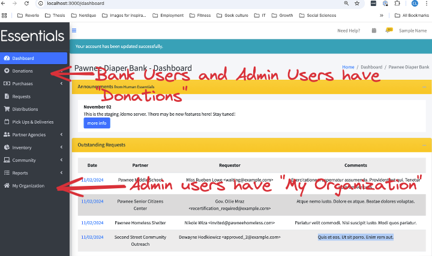
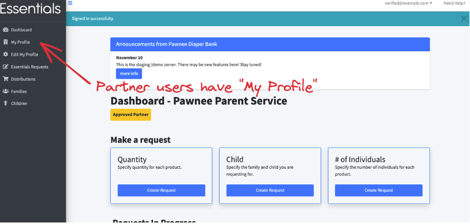
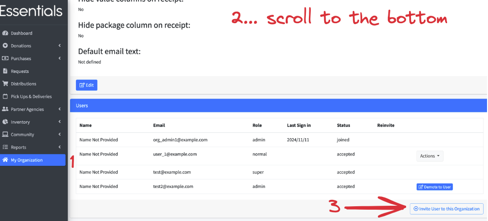
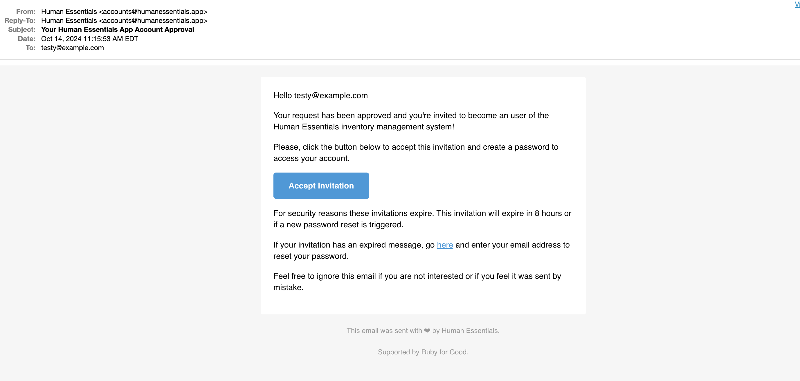
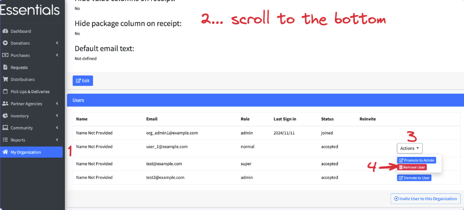
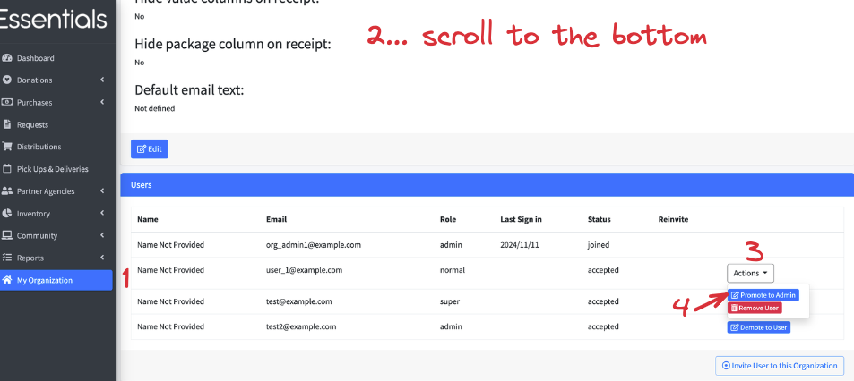

READY FOR REVIEW
# User Management

The bank organization admin Users can manage both the staff who have access to humanessentials.app at the bank, and at each of the bank's Partners.
The Partners can manage their own Users as well, but it is sometimes necessary for the bank to be able to add a User at the Partner due to staff turnover.

### How do I know what access I have?
If you look at the left-hand menu, and you see, down at the bottom, a section "My Organization", then you have admin access.
Otherwise,  if you see "Donations", you have bank User access.

If, instead, you see "My Profile", you are currently signed in as a Partner.

## Managing Bank staff access
To manage bank staff, you must be signed in as a User with admin rights.

### Adding a User
To add a User, sign in as someone who has bank admin access, then click on "My Organization" in the left-hand menu.
Scroll down to the bottom of that page.  You will see a section labelled "Users".
Check that the User is not already listed, then click on the "Invite User to this Organization" button in the bottom-right corner of the page.

In the window that pops up,  add the User's name and email,  then click "Invite User".

An email like the following will be sent to that email:  

When the new User clicks "Accept Invitation", they will be prompted to set their password.  Once they do, they will have bank User level access to the system.
### Deleting a User

When someone leaves your organization, you will want to remove their access to humanessentials.  To do that,
sign in as someone who has bank admin access, then 

(1) click on "My Organization" in the left-hand menu.
(2) Scroll down to the bottom of that page.  You will see a section labelled "Users".
Find the User you wish to delete.

*If* they had admin access, you will first need to demote them to User, by clicking their "Demote to User" button.

Then, (3) click the "Actions" button beside their name, and  
(4) click "Remove User".

Click "OK" on the confirmation screen.

### Giving a User admin access
To promote a User to have admin access,
(1) click on "My Organization" in the left-hand menu.
(2) Scroll down to the bottom of that page.  You will see a section labelled "Users".
Find the User you wish to promote.

Then, (3) click the "Actions" button beside their name, and
(4) Click "Promote to Admin"

Click "OK" on the confirmation screen.

### Removing admin access from a User.

To remove admin access from a User,  sign in as someone who has bank admin access, then (1) click on "My Organization" in the left-hand menu.
(2) Scroll down to the bottom of that page.  You will see a section labelled "Users".
Find the User you wish to remove admin access from.  (3) Click the "Demote to User" button beside their name and email.

Click "OK" on the confirmation screen.

### *Help!  Our admin quit and we don't have the access we need!*
Send a note to info@humanessentials.app explaining the situation.   We review that email on Sunday mornings.
You might be able to get faster turnaround by reaching out on the human essentials slack.

## Managing Partner access
See [Administering Partner Users](pm_partner_user_admin.md)

[Prior:  History](reports_history.md) [Next: Account Management](account_management.md)